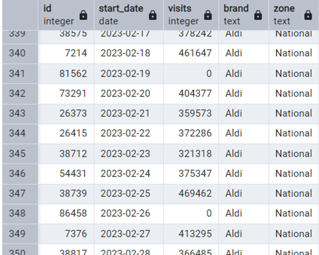
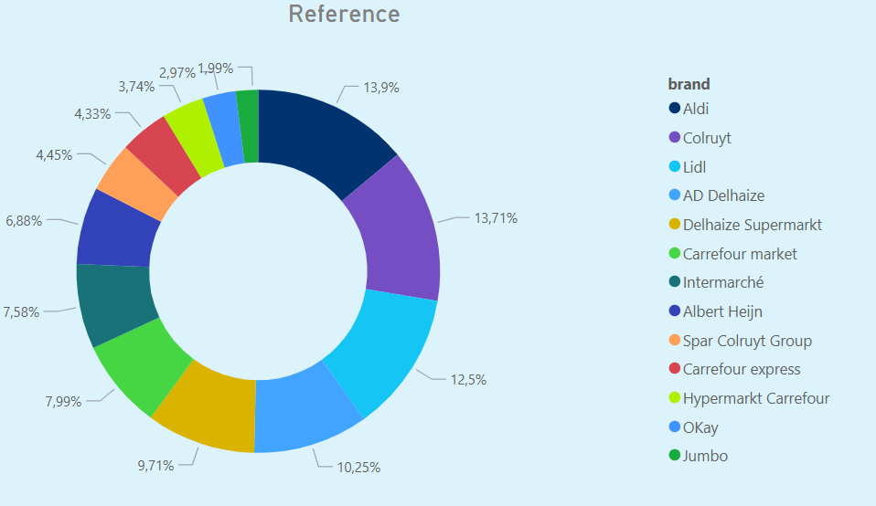
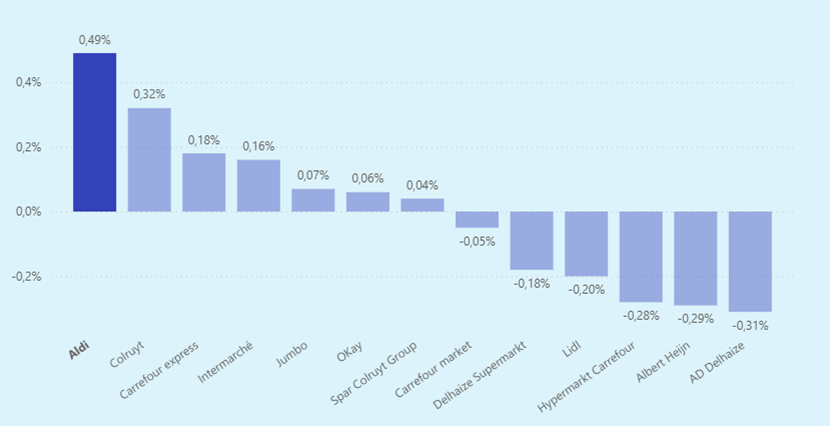

# 🛒 Aldi Campaign Analysis

In 2023, Aldi launched a Disney-themed campaign aimed at attracting more customers. This analysis evaluates the feasibility and potential impact of that campaign.
The project was carried out using Python, SQL, and Power BI. The results are presented in this [Presentation](Presentatie_Aldi_Kian.odp). Please note that the underlying data remains confidential.
If the Powerpoint does not load, please click: 'view raw' or 'download raw'.
***

## Data

The dataset is partially confidential and cannot be shared in its entirety. A small snippet is included below to illustrate its structure.

- **start_date**: The date on which measurements are taken.  
- **visits**: Total number of visits across all supermarkets of a given brand within a specific region on that date.  
- **brand**: The supermarket brand being measured.  
- **zone**: The cumulative geozone that includes all supermarkets located within that zone.  

## Insights
Following insights were made by using a combination of SQL, Python and Power BI. The insights of the national level (i.e. Belgium) are presented here. If you would like to see the insights of other administrative regions in Belgium, take a look at the [Presentation](Presentatie_Aldi_Kian.odp).

### Shares of visit

This donut graph indicates that of all visits in supermarkets in Belgium, 13.9% are visits to Aldi stores.  

This represents the supermarket landscape in the last week of January 2023, just before the Aldi Disney campaign that starts on 1 February.  

### Change in shares

During the fist week of February 2023, the previously mentioned landscape changes and Aldi recieves more visits relative to the other supermarkets.

This could be a small indicator that the campaign is working.

- **Reference**: week before the campaign
- **Campaign**: the full campaign
- **Post**: The month after the campaign

It can be seen that there is an increase in the shares of visit for Aldi during the campaign, but this increase continues after the campaign. Is  this the result of word to mouth or is there something else going on? (This will be explained later)

